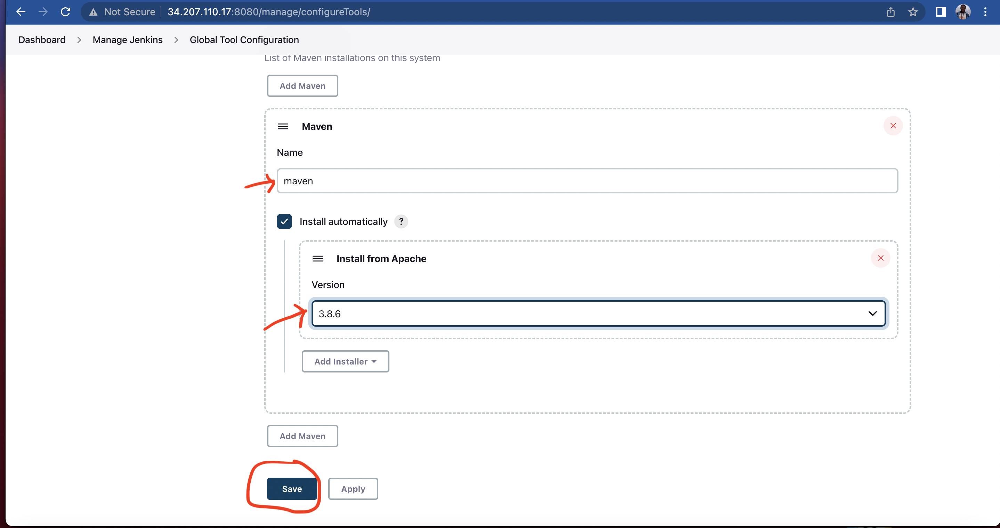

## Table of contents

<!-- TOC -->
* [Set up Jenkins server on AWS Cloud](#set-up-jenkins-server-on-aws-cloud)
  * [Spin up virtual machine on AWS](#spin-up-virtual-machine-on-aws)
  * [Install docker](#install-docker)
  * [Install Jenkins using docker](#install-jenkins-using-docker)
  * [Initialise Jenkins](#initialise-jenkins)
  * [Create admin user](#create-admin-user)
* [Install and Configure Plugins and Tools](#install-and-configure-plugins-and-tools)
  * [Configure Maven plugins](#configure-maven-plugins)
  * [Configure Docker](#configure-docker)
  * [Credential and Authentication](#credential-authentication)
  * [Configure Git Repo](#configure-git-repo)
* [Pipeline with Jenkinsfile](#pipeline-with-jenkinsfile)
  * [Jenkinsfile defined](#jenkinsfile-defined)
<!-- TOC -->

# Set up Jenkins server on AWS Cloud

This diagram describes the planned pipeline:


## Spin up virtual machine on AWS
- I am going to set up Jenkins server on AWS cloud platform using docker so I wouldn't need to install dependencies like java directly on the server, all needed is just docker to get started.

- Open an account with aws. It is recommended that, IAM user say iamadmin should be use to create the virtual machine(EC2), to follow through this demo instead of using root accounts.

- For firewall; I set the custom inbound rule at port 8080 for Jenkins. From where I will also expose it on the host from anywhere. Image below;


## Install docker
- Docker runtime; Next is to install Docker as my runtime environment by running below command;
    ```sudo yum update -y```
    ```sudo amazon-linux-extras install docker```
    ```sudo service docker start```

## Install Jenkins using docker
- Accessing Jenkins Application; Now that I had installed docker, I can then install and access the Jenkins app from browser by mapping the host-container port at 8080:8080 and at 50000:50000 where Jenkins and master communicate. I also want it to run in the background and attaching a volume to persist the data using -v jenkins_home, to referencing the name volume. With this command; 
    ``docker run -p 8080:8080 -p 50000:50000 -d \``
    `-v jenkins_home:/var/jenkins_home jenkins/jenkins:lts`
I then copy the instance IP address and port to browser to view Jenkins app; ```http://34.207.110.17:8080/```

## Initialise Jenkins
- Initialise Jenkins; Upon display on the browser, I supplied one-time use credential located at that path in red inside the container. 
How did I get this password? I change permission and ssh into the server, cd into the .pem file download. With this command; ```ssh -i <identity_file.pem> ec2-user@<hostname>```


- Enter the container; From the server, enter into the container by running this command;
    ```docker exec -it <container id> /bin/bash```
to view the content of the password with this command;
    ```cat /var/jenkins_home/secrets/initialAdminPassword```


## Create admin user
- Create admin user; I go with the Install suggested plugins and create admin user


# Install and Configure plugins and Tools

## Configure Maven plugins
- By default, maven plugin already install as suggested when initialing Jenkins. Only need to configure from  `Global Tool Configuration` under ``Manage Jenkins``tab by the left corner of the UI. 

- I give it a name and choose a version say maven and 3.6.3 respectively, then save. This enable maven command in my job. 

## Configure Docker
- If desire tools not available, in this case Docker, need to install it as plugins from the UI or directly on Jenkins server, which make it more flexible. Going for later option. So as to make Docker available in the Jenkins jobs.

## Credential and Authentication
- Need to configure and grant access to all tools and services Jenkins need to execute the jobs, in this case GitHub and Docker

## Configure Git Repo
- The whole essence of the project is to automate building and testing where git repo need to get connected to the Jenkins jobs.

# Pipeline with Jenkinsfile

## Jenkinsfile defined