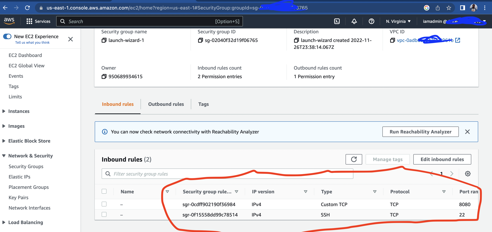
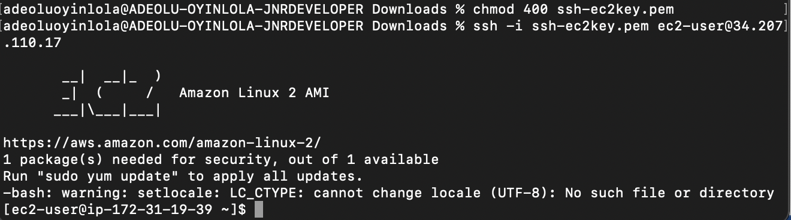
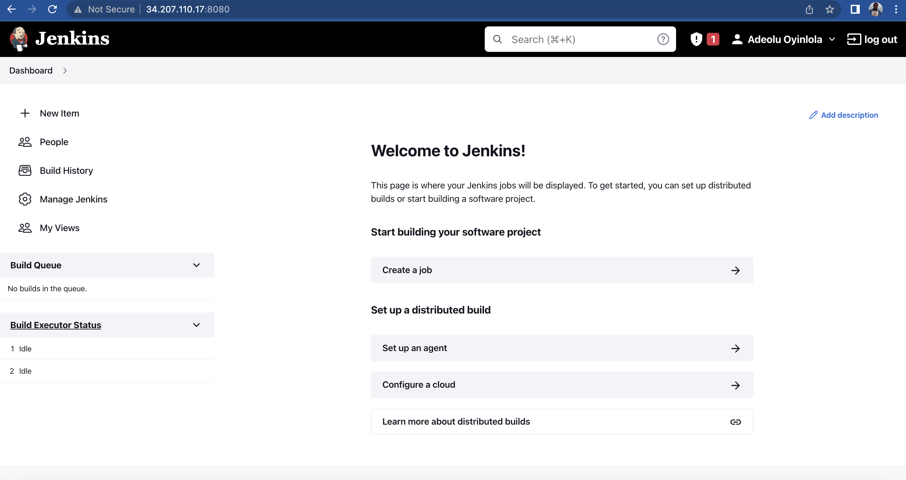
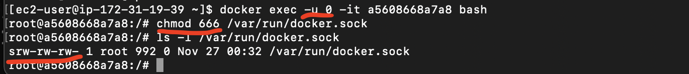

## Table of contents

<!-- TOC -->
* [Set up Jenkins server on AWS Cloud](#set-up-jenkins-server-on-aws-cloud)
  * [Spin up virtual machine on AWS](#spin-up-virtual-machine-on-aws)
  * [Install docker](#install-docker)
  * [Install Jenkins using docker](#install-jenkins-using-docker)
  * [Initialise Jenkins](#initialise-jenkins)
  * [Create admin user](#create-admin-user)
* [Configure Plugins and Tools](#configure-plugins-and-tools)
  * [Configure Maven plugins](#configure-maven-plugins)
  * [Configure Docker](#configure-docker)
  * [Credential and Authentication](#credential-authentication)
  * [Configure Git Repo](#configure-git-repo)
* [Pipeline with Jenkinsfile](#pipeline-with-jenkinsfile)
  * [Define Dependencies File](#jenkinsfile-defined)
  * [Dockerfile define](#jenkinsfile-defined)
  * [Jenkinsfile define](#jenkinsfile-defined)
<!-- TOC -->

This diagram describes the design:


# Set up Jenkins server on AWS Cloud
In this part, am going to spin up remote Jenkins server, install docker, initialise Jenkins and create admin user.

## Spin up virtual machine on AWS
- I am going to set up Jenkins server on AWS cloud platform using docker so I wouldn't need to install dependencies like java directly on the server, all needed is just docker to get started.

- Open an account with aws. It is recommended that, IAM user say iamadmin should be use to create the virtual machine(EC2), to follow through this demo instead of using root accounts.

- For firewall; I set the custom inbound rule at port 8080 for Jenkins. From where I will also expose it on the host from anywhere. Image below;



## Install docker
- First, to remotely access the VM, create key pair and download it from the AWS

- SSH into the VM; Each time must cd into where the downloaded .pem file are, then run this command; ```ssh -i <identity_file.pem> ec2-user@<hostname>```
- Docker runtime; Next is to install Docker as my runtime environment by running below command;
    ```sudo yum update -y```
    ```sudo amazon-linux-extras install docker```
    ```sudo service docker start```

## Install Jenkins using docker
- Accessing Jenkins Application; Now that I had installed docker, I can then install and access the Jenkins app from browser by mapping the host-container port at 8080:8080 and at 50000:50000 where Jenkins and master communicate. I also want it to run in the background and attaching a volume to persist the data using -v jenkins_home, to referencing the name volume. With this command; 
    ``docker run -p 8080:8080 -p 50000:50000 -d \``
    `-v jenkins_home:/var/jenkins_home jenkins/jenkins:lts`
I then copy the instance IP address and port to browser to view Jenkins app; ```http://34.207.110.17:8080/```

## Initialise Jenkins
- Initialise Jenkins; Upon display on the browser, I supplied one-time use credential located at that path in red inside the container. How I get this password is to view the file content inside the container 


- Enter the container; From the server, enter into the container by running this command;
    ```docker exec -it <container id> /bin/bash```
- View the content of the password with this command;
    ```cat /var/jenkins_home/secrets/initialAdminPassword```


## Create admin user
- Create admin user; I go with the Install suggested plugins and create admin user


# Configure plugins and Tools
Here, am going to configure maven plugin, install docker on the container, configure authentication for the required tools and plugins, configure git repo webhook.

## Configure Maven plugins
- By default, maven plugin already install as suggested when initialing Jenkins. Only need to add and configure from  `Global Tool Configuration` under ``Manage Jenkins``tab by the left corner of the UI.
- I give it a name and choose a version say maven and 3.8.6 respectively, then save. This enable maven command in my job.


## Configure Docker
- If a desire tools not available, in this case Docker, need to install it as plugins from the UI or directly on Jenkins server, which make it more flexible. Going for later option. So as to make Docker available in the Jenkins jobs.
- I will be attaching a volume to the Jenkins from the host file. Mounting the docker directoty from the AWS VM to container as volume. I stopped the container, create new one and re-attached the volume.
- Run the command; 
```docker run -p 8080:8080 -p 50000:50000 -d \```
```-v jenkins_home:/var/jenkins_home \```
```-v /var/run/docker.sock:/var/run/docker.sock \```
```-v $(which docker):/usr/bin/docker jenkins/jenkins:lts```
- File permission; to grant permission on the mounted file from the VM inside the container for Jenkins user. I need to enter the container as root user with ``docker exec -u 0 -it a5608668a7a8 bash``
- Then change permission; ``chmod 666 /var/run/docker.sock``

- Now I can execute docker command with Jenkins

## Credential and Authentication
- Need to configure and grant access to all tools and services Jenkins need to execute the jobs, in this case GitHub for the repository and Docker to build the image and push.
- Starting from the UI > Manage Jenkins > Manage Credential


## Configure Git Repo
- The whole essence of the project is to automate building and testing where git repo need to get connected to the Jenkins jobs through webhook. 
- I am going to populate the repo with the app source code base - src directory.

# Pipeline with Jenkinsfile
Here, I am going to define pom.xml file which contain all the app dependecies, Dockerfile which define base image, commands, CMD for entrypoint and Jenkinsfile that define all the stages and steps.
## Define Dependencies File
- I am going to define all dependencies for the java application inside a pom.xml file

## Dockerfile define
- In addition to build with maven, I can as well build an image and push to DockerHub with Docker. I am going to achieve this through Dockerfile file defination at the root of the repo

## Jenkinsfile define
- The final steps to achieve this automation is to define the workflow inside the Jenkinsfile file at the root of this repo.
- I am going to extract some functions to groovy file and get referenced inside the Jenkinsfile


# !
